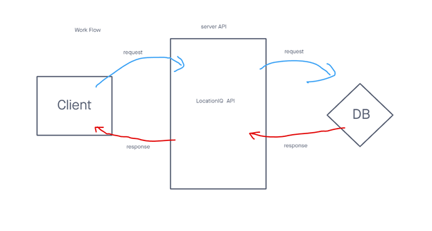
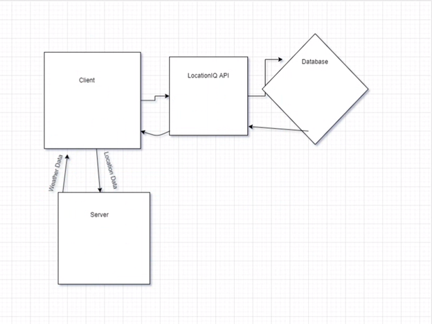
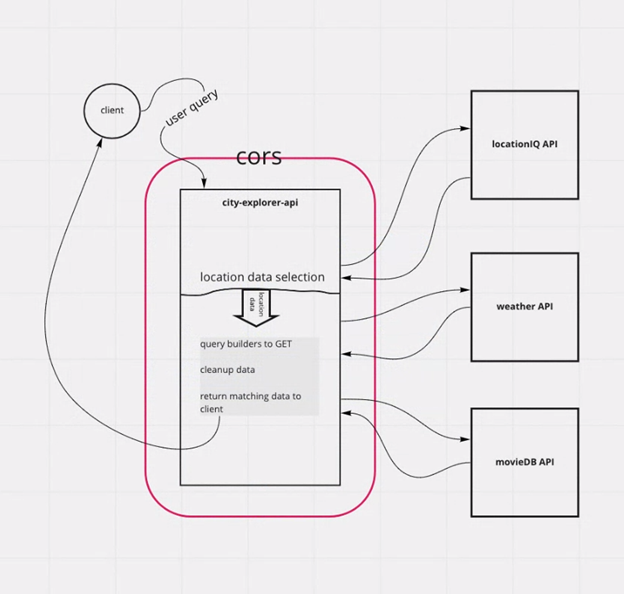

# City-Explorer

**Author**: Daniel Jackson
**Version**: 1.1.3

## Overview
This application will allow you to enter a city name, and return relevant information (and images) pertaining to the specified city. This uses the Location IQ API to get data and pull it in based on the user's input. 

## Getting Started
1. You'll need React, React-Bootstrap (if you'd like to us the pre-built components), axios (in order to easily do API calls), Location IQ API (for getting location data and map data), and GitHub/Netlify to deploy the project. 
2. You'll want to start by getting your React environment set up, and adding the necessary dependencies you are going to rely on. Again, here I used Axios in order to reach out and do API calls, but you can choose what you like. 
3. One important thing to note about Location IQ API is you need to have authorization to receive data, so make sure on the Location IQ API website, under "API Access Tokens", that you authorize the URL the requests will be coming from (`http://localhost:3000/` OR `https://netlify-app-address/`)
4. Once you have your client able to reach [Location IQ API](https://locationiq.com/), you'll want to set up a search bar that accepts user input. Again, I use React Bootstrap for nice pre-built components, but you can do this how you like. 
5. You'll want to take the user input, and use it as a _query_ for your API request. If the user types in __'seattle'__, your request should look something like this:  
`https://us1.locationiq.com/v1/search.php?key=YOUR_LOCATION_IQ_KEY&q=seattle&format=json` 
** ___notice the information after the '?' is listed in __key-value pairs__, first the __key__, then _=_, followed by the __value__. This is important to understand so you know how to query data.___
6. You can then take this location information and print a map to the screen. This is easier than doing a GET request from the Location IQ API, because the img element has this functionality _built-in_. If you have the returned data, and you extract the latitute and longitude, your ` ` should look something like this:  
`https://maps.locationiq.com/v3/staticmap?key=YOUR_LOCATION_IQ_KEY&center=MAP_LOCATION_LATITUDE,MAP_LOCATION_LONGITUDE&zoom=12&size=1000x1000&format=jpg&maptype=roadmap`
7. Use the received data and output or render something to the screen. Here I chose to output the location name, followed by a map of the location, and the latitude and longitude of the location. There is a lot of useful information you get from Location IQ API, so play around with it and make something unique. 

## Architecture
This application uses React, React Bootstrap (for importing/styling prebuilt components), axios in order to make API calls, Location IQ API (for location data), and GitHub/Netlify for deployment.

## Change Log
12-06-2021 9:05pm - Application is rendering data from user input on local server, trying to resolve bug regarding pushing build to test server  
12-07-2021 7:15am - Application is now properly displaying on test server, fixed bug regarding an empty code block on Main.js  
12-07-2021 10:00am - Application is rendering error modal if the input location is invalid  
12-07-2021 4:38pm - Application is able to operate on local host, and GET from server on local host, and render weather data accordingly  
12-08-2021 7:08am - Updates README file to be a lot more precise in giving instructions.

## Credit and Collaborations
- [background image of site](https://unsplash.com/photos/8Ogfqvw15Rg), found on https://unsplash.com/, and shot by [Joel Vodell](https://unsplash.com/@joelvodell).
- Michael Milsap - helping me get over the 'rendering the map' hump of this project. 
- Sara Russert - for being very informative about GET method and implementing the data from the return value, as well as just being a phenomenal instructor. 

## Pics For Request/Data Flow

  
  

